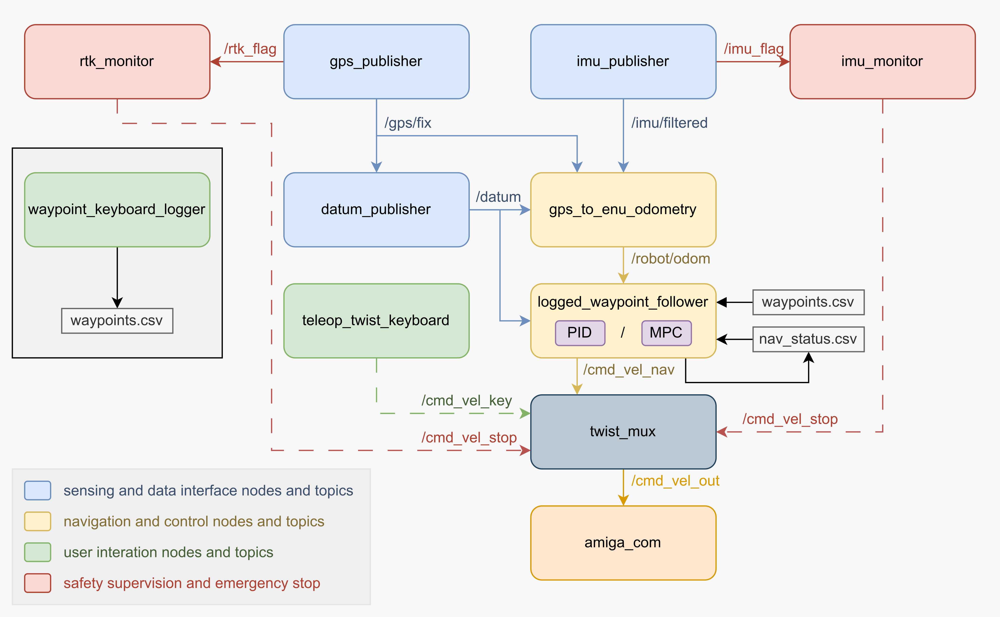

# Amiga_Navigation

Last updated by [Yiyuan Lin](yl3663@cornell.edu) on July 7, 2025

---


This is the ROS 2 package for GPS waypoint based navigation on Farm-ng Amiga robot with Emlid Reach RS3 GNSS receiver. The codebase is deployed on Raspberry Pi 5 with ROS2 Jazzy. 


## Overview




## Hardware

1. Farm-ng Amiga robot
2. Emlid Reach RS3 GNSS receiver
3. Raspberry Pi
4. Adafruit Feather M4 CAN micro controller


## Dependencies

1. Install Ubuntu 24.04 on Raspberry Pi 5

2. Install ROS2 Jazzy on Raspberry Pi 5 (Ubuntu) following the official [instruction](https://docs.ros.org/en/jazzy/Installation/Ubuntu-Install-Debs.html).

3. Install necessary Python packages by running

   ```bash
   pip install pyserial numpy simple-pid pynmea2 pyproj
   ```

   If you're on a Debian/Ubuntu system with a managed Python environment, , you may need to add the `--break-system-packages` flag:

   ```bash
   pip install --break-system-packages pyserial numpy simple-pid pynmea2 pyproj
   ```

   Or, to avoid conflicts, you can use a virtual environment.


## Getting Start [TODO]

1. Edit the devices, port, parameters to your own setup.


2. log the waypoint for navigation


3. Execute the waypoint based navigation by running

   ```bash
   ros2 run amiga_navigation bring_up.launch.py
   ```

   
