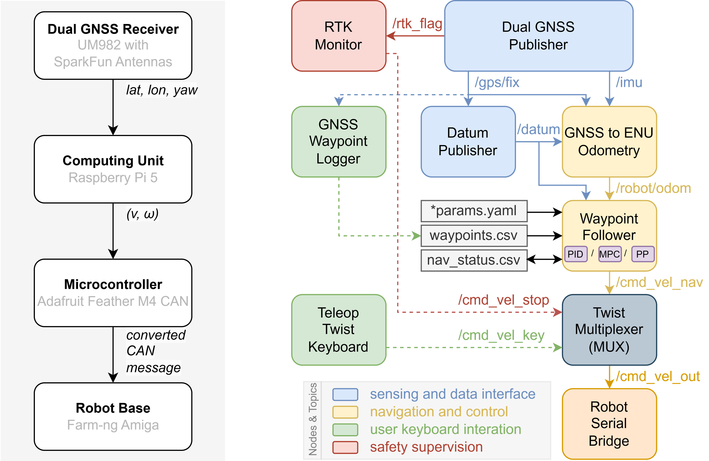

# PPBv2 Amiga Navigation

Last updated by [Yiyuan Lin](yl3663@cornell.edu) on Aug 10, 2026

#### 

## Overview

This repository contains the ROS 2 navigation package used for GNSS waypoint navigation on a Farm-ng Amiga robot. The current stack is designed for a Raspberry Pi 5 running Ubuntu 24.04 and ROS 2 Jazzy, with a dual-antenna UM982 GNSS receiver and an Adafruit Feather M4 CAN microcontroller. The UM982 provides RTK position, true heading, and pitch without a separate IMU.

Most of the stack is robot-base independent. The UM982 driver, datum handling, waypoint logger, waypoint follower, controller implementations, RTK safety monitor, and `twist_mux` pipeline can be reused on another robot base. To use a different base, replace or create the final bridge that converts `/cmd_vel_out` into that robot's command interface.

Maintainers and coding agents could also read [`HANDOFF.md`](HANDOFF.md) before changing the GNSS, geometry, safety, or control pipeline.

The package supports multiple waypoint tracking controllers:

- `pid_line`: PID cross-track-error line tracker.
- `pure_pursuit`: geometric pure pursuit tracker.
- `mpc_rollout`: sampling-based rollout MPC tracker.
- `mpc_formal`: optimization-based receding-horizon MPC tracker.
- `row_hybrid`: segment-length-aware hybrid controller for row navigation. It uses formal MPC for short connectors, pure pursuit for medium segments, and PID line tracking for long row segments.



#### 

## Hardware

- [Farm-ng Amiga robot](https://store.farm-ng.com/) (you can also use your own robot base and create a node for low-level controller communication)
- [UM982 dual-antenna GNSS receiver](https://www.amazon.com/dp/B0FCFZXDDJ?lv=shuf&rsd=D5eDWMLU%2BlZo6H0ytWeBpEDHKXB%2FOcsDmcQZWwHV38CM3ISNZMfZLK1%2FrAAe8%2Fnf8sC3sOUDDCqGa9AzsXbzcDa01EuH3%2FG1VnOwXIxYSYYF&edk=AQIDAHi1lw%2FM8UbbSMD9ScOOFEmBMHMthHeEhqDaQYPJUAX3jQFkG1KajJRK0UpRjdW%2FOK8dAAAAfjB8BgkqhkiG9w0BBwagbzBtAgEAMGgGCSqGSIb3DQEHATAeBglghkgBZQMEAS4wEQQMNue5pNQTD4syVtUoAgEQgDu7Fq4A7aVxOrC%2BURE4feV3vhHwf5frlgX6dqASVvksRvEaQAYA46izYui3WygErr4Sb%2BhMZgkKwi79wQ%3D%3D&social_share=cm_sw_r_apin_dp_TP36CY53FWREGK9BPECT&channelId=704&ref_=cm_sw_r_apin_dp_TP36CY53FWREGK9BPECT&plpRedirect=mhFallback&th=1)
- [GNSS Multi-Band L1/L2/L5 Surveying Antenna - TNC (SPK6618H)](https://www.sparkfun.com/gnss-multi-band-l1-l2-l5-surveying-antenna-tnc-spk6618h.html?gad_source=1&gad_campaignid=21251727806&gbraid=0AAAAADsj4ESEiGaW3DcX3fRbrfV9ID-rR) **x2**
- [Raspberry Pi 5](https://www.raspberrypi.com/products/raspberry-pi-5/)
- [Adafruit Feather M4 CAN microcontroller](https://learn.adafruit.com/adafruit-feather-m4-can-express/overview)

#### 

## Dependencies

1. Install Ubuntu 24.04 on Raspberry Pi 5

2. Install ROS2 Jazzy on Raspberry Pi 5 (Ubuntu) following the official [instruction](https://docs.ros.org/en/jazzy/Installation/Ubuntu-Install-Debs.html).

3. Install necessary ROS2 packages and Python tools

   ```bash
   sudo apt install \
     python3-colcon-common-extensions \
     python3-pip \
     python3-setuptools \
     ros-jazzy-geographic-msgs \
     ros-jazzy-tf-transformations \
     ros-jazzy-twist-mux
   ```

4. Install necessary Python packages by running

   ```bash
   pip install pyserial numpy scipy simple-pid pyproj
   ```

   If you're on a Debian/Ubuntu system with a managed Python environment, , you may need to add the `--break-system-packages` flag:

   ```bash
   pip install --break-system-packages pyserial numpy scipy simple-pid pyproj
   ```

   Or, to avoid conflicts, you can use a virtual environment.

5. Build and source the ROS 2 navigation workspace:

   ```bash
   cd PPBv2_Navigation  # The workspace root directory containing the src folder
   colcon build --symlink-install
   source install/setup.bash
   ```

   When opening a new terminal, source both the ROS 2 environment and the workspace before running any nodes:
   
   ```bash
   source /opt/ros/jazzy/setup.bash
   cd /path/to/PPBv2_Navigation
   source install/setup.bash
   ```

   Optionally, add these commands to `~/.bashrc` to source them automatically in each new terminal:
   
   ```bash
   echo "source /opt/ros/jazzy/setup.bash" >> ~/.bashrc
   echo "source /path/to/PPBv2_Navigation/install/setup.bash" >> ~/.bashrc
   source ~/.bashrc
   ```

#### 

## Getting Started

### 1. Basic configuration

Configure the UM982 receiver, NTRIP connection, antenna geometry, and hardware ports before starting the navigation stack.

#### 1.1 UM982 and NTRIP

Edit `src/amiga_navigation/config/bringup.yaml` and set the stable UM982 `serial_port`, `baseline_m`, Feather M4 serial bridge settings, and all NTRIP connection fields, including `ntrip_password`.

Example NTRIP configuration:

```yaml
ntrip_host: "your-ntrip-host"
ntrip_port: 8002
ntrip_mountpoint: "your-mountpoint"
ntrip_username: "your-username"
ntrip_password: "your-password"
ntrip_use_tls: false
```

Do not commit real NTRIP credentials to a public repository.

`um982_driver` exclusively owns the single full-duplex USB serial connection. It reads GGA and NIHEADINGA while writing RTCM received from the fixed-base NTRIP mountpoint. Published positions represent the geometric midpoint between ANT1 and ANT2, while odometry orientation represents the robot's forward
direction.

#### 

#### 1.2 Antenna layout

UM982 reports true heading along the physical baseline from ANT1 (master position antenna) toward ANT2 (heading/slave antenna). Configure that baseline relative to robot forward with `antenna_baseline_angle_deg`. Angles are viewed from above and positive clockwise, toward the robot's right:

| Physical layout | `antenna_baseline_angle_deg` |
|---|---:|
| ANT1 rear, ANT2 front | `0.0` |
| ANT1 front, ANT2 rear | `180.0` |
| ANT2 directly right of ANT1 | `90.0` |
| ANT2 directly left of ANT1 | `-90.0` |

For example:

```yaml
baseline_m: 1.28
antenna_baseline_angle_deg: 90.0
heading_offset_deg: 0.0
```

In this example ANT2 is mounted to the robot's right of ANT1. The driver uses the raw ANT1-to-ANT2 heading to calculate the antenna midpoint, then subtracts 90 degrees to obtain robot-forward heading. `heading_offset_deg` is a separate, optional fine calibration and should normally remain `0.0`.

NTRIP v1 (`ICY`) and v2 (`HTTP`) responses are handled automatically. Plain TCP versus TLS is an explicit `ntrip_use_tls` setting so credentials are never silently probed over cleartext.

Building with `--symlink-install` lets later YAML edits take effect without rebuilding. With a normal installation, launch directly with the source YAML:

```bash
ros2 launch amiga_navigation basic_bringup.launch.py \
  bringup_config:="/home/cairlab/PPBv2_Navigation/src/amiga_navigation/config/bringup.yaml"
```

The driver configures rover mode, the fixed baseline, and 10 Hz GGA plus UNIHEADINGA output at startup. Set `configure_receiver_on_start: false` only when the receiver configuration is managed elsewhere.

#### 

#### 1.3 Hardware ports

Before running on the robot, update the serial device paths in:

- `src/amiga_navigation/config/bringup.yaml` for UM982, baseline, quality limits, NTRIP, GPS status logging, and the Feather M4 CAN serial bridge.

The bringup YAML uses `/dev/serial/by-id/...` paths for the UM982 and Feather M4. Those paths are stable on one robot, but usually need to be checked after replacing hardware.

#### 

### 2. Start the base stack without waypoint following

   ```bash
   ros2 launch amiga_navigation basic_bringup.launch.py
   ```

For debug logging, use:

   ```bash
   ros2 launch amiga_navigation nav_debug.launch.py
   ```

This starts the same base stack plus `nav_topic_debug_logger`. It still does not start `waypoint_follower`; run the follower separately so you can choose the waypoint file and controller.

#### 

### 3. Record waypoints for navigation (optional)

If the base stack is not already running, launch it with:

   ```bash
   ros2 launch amiga_navigation basic_bringup.launch.py
   ```

Then start the GNSS waypoint logger:

   ```bash
   ros2 run amiga_navigation gnss_waypoint_keyboard_logger
   ```

Controls:

   - Press `SPACE` to save the current GNSS fix as a waypoint.
   - Press `q` or `CTRL+C` to quit.

By default, waypoint files are saved in:

   ```text
   /home/cairlab/navigation_waypoints
   ```

The logger generates the following files:

- `latest_waypoints.csv`: Contains the most recently recorded waypoint sequence and is overwritten each time the logger is used.

   - `waypoints_YYYY_MM_DD_HH_MM_SS.csv`: A timestamped historical copy. A custom filename may also be provided when saving a snapshot.

Waypoint CSV format:

   ```csv
   latitude,longitude
   42.000000,-76.000000
   42.000010,-76.000005.
   ```

   > [!NOTE]
   >
   > Waypoints may also be generated using GIS-based tools or any other preferred waypoint collection method. For consistent RTK positioning, ensure that the waypoints are collected using corrections from the same RTK base station used by the robot's GNSS receiver.

####    

### 4. Run waypoint-based navigation

 If the base stack is not already running, launch it with:

   ```bash
   ros2 launch amiga_navigation basic_bringup.launch.py
   ```

In another terminal, run the waypoint follower:

   ```bash
   ros2 run amiga_navigation waypoint_follower --waypoints /home/cairlab/navigation_waypoints/latest_waypoints.csv #replace with your waypoint file path
   ```

**The waypoints follower automatically loads `src/amiga_navigation/config/waypoint_follower_params.yaml` when available.**

> [!IMPORTANT]
>
> The waypoint follower stores navigation progress in:
>
>    ```text
> /home/cairlab/navigation_waypoints/status.txt
> /home/cairlab/navigation_waypoints/last_waypoints.csv
>    ```
>


> [!TIP]
>
> **Tip 1. To choose a controller from the command line:**
>
>    ```bash
> ros2 run amiga_navigation waypoint_follower \
>   --waypoints /home/cairlab/navigation_waypoints/latest_waypoints.csv \
>   --controller pid_line
>    ```
>
> Valid controller choices are:
>
>    ```text
> pid_line
> pure_pursuit
> mpc_rollout
> mpc_formal
> row_hybrid
>    ```
>
> The CLI `--controller` value overrides the `controller_type` value in `waypoint_follower_params.yaml` for that run.
>
> #### 
>
> **Tip 2. The resume mode can be selected with:**
>
>    ```bash
> ros2 run amiga_navigation waypoint_follower --resume ask
> ros2 run amiga_navigation waypoint_follower --resume yes
> ros2 run amiga_navigation waypoint_follower --resume no
>    ```
>
> Resume mode controls what happens when the follower detects an unfinished previous route. It uses `status.txt` to remember the last reached waypoint index and `last_waypoints.csv` as a snapshot of the route that was being followed.
>
> The default resume mode is `ask`. `--resume` can be combined with `--waypoints` and `--controller` in the same command.
>
>    - `ask` (default): prompt in an interactive terminal when unfinished navigation is found.
>    - `yes`: automatically continue from `last_waypoints.csv`.
>    - `no`: ignore previous progress and start from the requested waypoint file.
>
> #### 
>
> **Tip 3. As an additional manual override, users can run `teleop_twist_keyboard` in another terminal:**
>
>    ```bash
> ros2 run teleop_twist_keyboard teleop_twist_keyboard --ros-args -r cmd_vel:=cmd_vel_key
>    ```
>
> The `twist_mux` configuration gives `/cmd_vel_key` the highest priority, so keyboard commands override waypoint navigation commands. This is useful for manual control during testing or when the operator needs to take over quickly.

#### 

## Controller Configuration

The waypoint follower converts GPS waypoints from `(latitude, longitude)` into a local ENU frame using the first RTK-fixed GPS point as the datum. For each segment from $p_i$ to $p_{i+1}$, it computes the reference heading $\psi_{ref}$, robot heading $\psi$, signed cross-track error $e_y$, and heading error $e_\psi$.

<p align="center">
  
</p>

Before tracking each segment, `alignment_turn_controller.py` rotates the robot in place until $|e_\psi|$ is below `alignment_threshold`. The selected tracking controller then publishes velocity commands to `/cmd_vel_nav`.

Controller behavior:

| Controller | Description | Good for |
| --- | --- | --- |
| `pid_line` | PID feedback on signed cross-track error. | Long, straight row segments. |
| `pure_pursuit` | Steers toward a lookahead point on the segment. | Smooth waypoint paths with simple tuning. |
| `mpc_rollout` | Samples candidate commands and chooses the lowest-cost rollout. | MPC-like behavior with predictable runtime. |
| `mpc_formal` | Solves a receding-horizon optimization problem with SciPy SLSQP. | Short connectors or tighter maneuvers. |
| `row_hybrid` | Switches between `mpc_formal`, `pure_pursuit`, and `pid_line` by segment length. | Routes with both long crop rows and short connectors. |

#### 

### PID line tracking (`pid_line`)

The PID controller tracks the infinite line defined by the current waypoint segment. Its lateral correction speed is:

$$
v_{y,l} = K_p e_y(t) + K_i \int e_y(t)\,dt + K_d \frac{d e_y(t)}{dt}
$$

The follower combines this lateral correction with forward path speed, converts it into differential-drive commands, and adds heading correction through `heading_gain`.

| Parameter | Increase to... | Decrease to... |
| --- | --- | --- |
| `pid_kp` | Correct lateral error faster. | Reduce overshoot or left-right oscillation. |
| `pid_ki` | Remove steady drift to one side. | Reduce slow oscillation or integral wind-up. |
| `pid_kd` | Dampen oscillation and smooth correction. | Make the response less sluggish. |
| `heading_gain` | Align the robot heading more aggressively with the path. | Reduce heading-induced oscillation. |

`max_lateral_speed` limits the PID output, while `max_heading_for_full_speed` and `max_cross_track_error` reduce forward speed as tracking error rows. This controller is usually the most stable choice for long, straight crop rows.

#### 

### Pure pursuit (`pure_pursuit`)

Pure pursuit projects the robot onto the current segment and places a target point a lookahead distance farther along that segment. The configured lookahead is proportional to nominal speed and clipped to a safe range:

$$
L_d = \operatorname{clip}
\left(v_{target}K_{lookahead},\ L_{min},\ L_{max}\right)
$$

If $\alpha$ is the heading angle from the robot to the lookahead point, the controller calculates curvature and angular velocity as:

$$
\kappa = \frac{2\sin(\alpha)}{L_{actual}},
\qquad
\omega = \operatorname{clip}(v\kappa,\ -\omega_{max},\ \omega_{max})
$$

The lookahead point is capped at the segment endpoint. Forward speed is reduced near the start or goal when the shared slowdown options are enabled, and it is also reduced for a large lookahead heading error.

| Parameter | Increase to... | Decrease to... |
| --- | --- | --- |
| `pure_pursuit_min_lookahead` | Smooth steering and reduce short-range oscillation. | Follow tighter turns and react sooner to lateral error. |
| `pure_pursuit_max_lookahead` | Allow smoother tracking at higher speed. | Prevent the controller from looking too far ahead. |
| `pure_pursuit_lookahead_gain` | Increase lookahead for the same `target_speed`. | Make steering more responsive and less anticipatory. |
| `pure_pursuit_slowdown_distance` | Begin slowing earlier before a waypoint. | Maintain nominal speed closer to the waypoint. |

Start with `pure_pursuit_min_lookahead`. Increase it if steering oscillates; decrease it if the robot cuts corners or reacts too slowly. Very large lookahead
values give smooth commands but can leave a persistent cross-track error on short segments.

#### 

### Sampling-based rollout MPC (`mpc_rollout`)

At every control cycle, rollout MPC first applies the shared speed schedule to obtain a base speed. It evaluates three linear-speed scales (`0.35`, `0.6`, and
`1.0` times the base speed) against evenly spaced angular-velocity candidates from $-\omega_{max}$ to $+\omega_{max}$.

For each candidate pair $(v,\omega)$, the controller predicts the unicycle model for `mpc_horizon_steps`, using `mpc_step_time` for each step. The same $(v,
\omega)$ pair is held throughout one rollout:
$$
x_{k+1}=x_k+v\cos(\psi_k)\Delta t,\qquad
y_{k+1}=y_k+v\sin(\psi_k)\Delta t
$$

$$
\psi_{k+1}=\operatorname{wrap}(\psi_k+\omega\Delta t)
$$

The evaluated cost is:

$$
J = \sum_{k=1}^{N}
\left(w_y|e_{y,k}|+w_\psi|e_{\psi,k}|+w_u|\omega|\right)
+w_g d_{goal,N}-w_p s_N
$$

where $s_N$ is progress along the segment. The lowest-cost candidate is sent to the robot. This controller has bounded, predictable computation because it does not invoke a nonlinear optimizer.

| Parameter | Increase to... | Decrease to... |
| --- | --- | --- |
| `mpc_horizon_steps` | Consider behavior farther into the future. | Reduce computation and make decisions more local. |
| `mpc_step_time` | Extend predicted time without adding steps. | Use finer, shorter-term prediction. |
| `mpc_candidate_count` | Search angular velocity more finely. | Reduce computation time. |
| `mpc_cross_track_weight` | Prioritize returning to the segment centerline. | Permit more lateral deviation. |
| `mpc_heading_weight` | Prioritize alignment with segment heading. | Allow heading error while pursuing position/progress. |
| `mpc_goal_distance_weight` | Favor candidates ending closer to the waypoint. | Reduce attraction to the segment endpoint. |
| `mpc_effort_weight` | Penalize turning and produce gentler commands. | Allow more aggressive angular commands. |
| `mpc_progress_weight` | Reward forward progress more strongly. | Favor tracking accuracy over progress. |
| `mpc_slowdown_distance` | Begin slowing earlier before the goal. | Maintain speed closer to the goal. |

The prediction duration is approximately `mpc_horizon_steps * mpc_step_time`. Increasing both horizon length and candidate count raises CPU cost. Tune the tracking weights before enlarging the search.

### Optimization-based MPC (`mpc_formal`)

Formal MPC optimizes a different linear and angular velocity for every step in the prediction horizon:

$$
U=\{(v_0,\omega_0),\ldots,(v_{N-1},\omega_{N-1})\}
$$

It uses the same unicycle prediction model as rollout MPC, but solves the bounded nonlinear optimization with SciPy SLSQP. Only the first optimized
command is applied; at the next control cycle the horizon is solved again. The previous solution is shifted forward as a warm start. If SLSQP fails, the
controller falls back to that warm-start sequence for the current cycle. Its running cost penalizes squared cross-track error, heading error, normalized
goal distance, deviation from the scheduled forward speed, angular effort, and step-to-step control changes. It rewards progress along the segment. Separate terminal weights strongly shape the final predicted state:
$$
J=\sum_{k=1}^{N}
\left(
w_y e_{y,k}^2+w_\psi e_{\psi,k}^2+w_g\bar d_{g,k}^2
+w_v(v_k-v_{desired})^2+w_\omega\omega_k^2
+w_{\Delta v}\Delta v_k^2+w_{\Delta\omega}\Delta\omega_k^2
-w_p s_k
\right)+J_{terminal}
$$

| Parameter | Increase to... | Decrease to... |
| --- | --- | --- |
| `formal_mpc_horizon_steps` | Plan farther ahead. | Reduce solver work and latency. |
| `formal_mpc_step_time` | Cover a longer prediction time per step. | Model motion at finer time resolution. |
| `formal_mpc_min_forward_speed` | Prevent very slow or stopped solutions. | Allow the optimizer to slow down more for tight maneuvers. |
| `formal_mpc_cross_track_weight` | Hold the centerline more strongly. | Permit lateral deviation. |
| `formal_mpc_heading_weight` | Align heading more strongly throughout the horizon. | Give position and progress more influence. |
| `formal_mpc_goal_distance_weight` | Pull the predicted trajectory toward the waypoint. | Reduce running goal attraction. |
| `formal_mpc_terminal_*` | Enforce the corresponding error more strongly at the end of the horizon. | Make terminal behavior less dominant. |
| `formal_mpc_linear_effort_weight` | Stay closer to the scheduled forward speed. | Allow speed changes to improve tracking. |
| `formal_mpc_angular_effort_weight` | Reduce angular velocity magnitude. | Permit sharper turns. |
| `formal_mpc_linear_smooth_weight` | Smooth changes in forward speed. | Allow faster acceleration/deceleration changes. |
| `formal_mpc_angular_smooth_weight` | Smooth steering commands. | Allow angular velocity to change more rapidly. |
| `formal_mpc_progress_weight` | Favor progress along the segment. | Favor error minimization over forward progress. |
| `formal_mpc_solver_maxiter` | Give SLSQP more opportunity to converge. | Bound solver time more tightly. |
| `formal_mpc_solver_ftol` | Use a looser convergence tolerance when increased. | Demand a more precise solution, with potentially more iterations. |

Tune formal MPC at a low `target_speed` first. If the solver is too slow, reduce `formal_mpc_horizon_steps` or `formal_mpc_solver_maxiter`. If commands are jittery, raise the smoothness weights before increasing the horizon.

#### 

### Row hybrid controller (`row_hybrid`)

The hybrid controller chooses an existing controller once per current segment according to its length $L$:

| Segment length | Active controller | Intended behavior |
| --- | --- | --- |
| $L \leq$ `row_connector_length_threshold` | `mpc_formal` | Optimize short connectors and tight transitions. |
| `row_connector_length_threshold` $< L <$ `row_length_threshold` | `pure_pursuit` | Smoothly track medium-length segments. |
| $L \geq$ `row_length_threshold` | `pid_line` | Track long, straight crop rows efficiently. |

Increase `row_connector_length_threshold` to classify more segments as short MPC connectors. Decrease `row_length_threshold` to classify more segments as long PID-controlled rows. The thresholds must reflect the actual route geometry; the controller does not infer whether a segment is physically a crop row.

> [!IMPORTANT]
>
> All controller parameters are centralized in:
>
> ```bash
> src/amiga_navigation/config/waypoint_follower_params.yaml
> ```
>
> Important shared parameters:
>
> - `control_frequency`
> - `max_odom_age_sec`
> - `controller_type`
> - `target_speed`
> - `max_angular_speed`
> - `min_forward_ratio`
> - `max_cross_track_error`
> - `goal_threshold`
> - `alignment_threshold`
>
> Controller-specific parameter names are grouped in the same YAML file by prefix, such as `pid_*`, `pure_pursuit_*`, `mpc_*`, `formal_mpc_*`, and `row_*`.


## Logging and Debugging

The follower can publish structured debug messages on:

```text
/nav/controller_debug
```

Inspect them with:

```bash
ros2 topic echo /nav/controller_debug
```

When `enable_csv_logging` is true, the follower writes per-cycle control logs to:

```text
/home/cairlab/navigation_waypoints/waypoint_control_log_<timestamp>.csv
```

The CSV log includes phase, active controller, waypoint index, pose, heading error, cross-track error, distance to goal, target speed, and command velocity.

Useful runtime checks:

```bash
ros2 topic echo /gps/fix
ros2 topic echo /gps/rtk_status_flag
ros2 topic echo /um982/heading_deg
ros2 topic echo /um982/pitch_deg
ros2 topic echo /robot/odom
ros2 topic echo /cmd_vel_nav
ros2 topic echo /cmd_vel_out
```


## Feather M4 MCU

The `FeatherM4_MCU/code.py` script receives serial velocity commands from the Raspberry Pi and sends Amiga CAN control commands.

This bridge is the Amiga-specific part of the stack. For another robot base, keep the upstream ROS topics and navigation nodes the same, but implement a different bridge node that subscribes to `/cmd_vel_out` and sends the equivalent velocity command to your robot's motor controller, CAN bus, serial protocol, or vendor API.

Upload `FeatherM4_MCU/code.py` to the Feather M4 CAN microcontroller following the Farm-ng MCU kit documentation:

```text
https://amiga.farm-ng.com/docs/mcu_kit/
```

The ROS-side serial bridge sends commands in this format:

```text
linear_velocity,angular_velocity
```

Example:

```text
0.500000,0.100000
```


## Safety Notes

- Confirm the Amiga is in the correct autonomous-ready state before sending navigation commands.
- Verify RTK fixed status before logging or following waypoints. The robot will stop once RTK FIX is lost.
- Start with low `target_speed` when testing a new field, new waypoint route, or new controller.
- Keep `max_cross_track_error` conservative. The waypoint follower stops if cross-track error exceeds this limit.
- The serial bridge has a watchdog that sends a stop command if `/cmd_vel_out` stops updating.
- Always test controller changes in an open area before running between rows.


## Maintenance

For questions, contact Yiyuan Lin at yl3663@cornell.edu.
