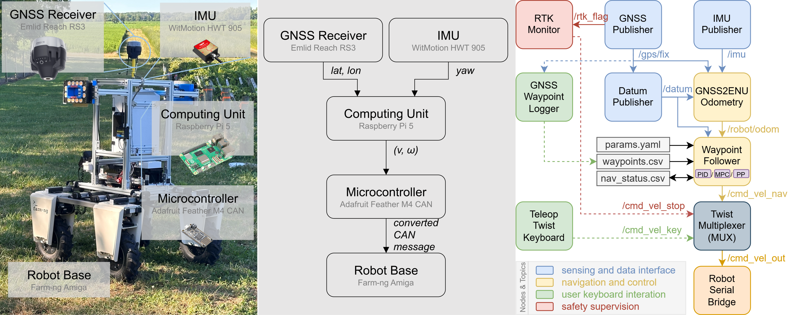
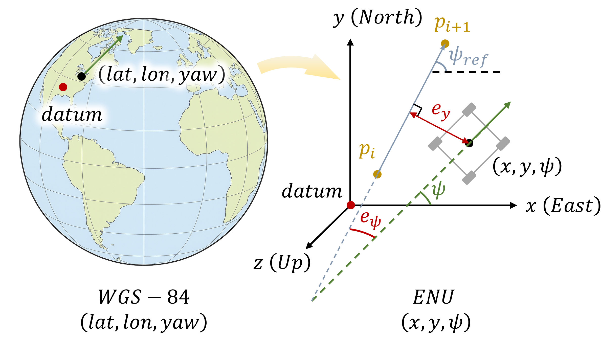

# PPBv2 Amiga Navigation

Last updated by [Yiyuan Lin](yl3663@cornell.edu) on July 22, 2026.


## Overview

This repository contains the ROS 2 navigation package used for GNSS waypoint navigation on a Farm-ng Amiga robot. The current stack is designed for a Raspberry Pi 5 running Ubuntu 24.04 and ROS 2 Jazzy, with a dual-antenna UM982 GNSS receiver and an Adafruit Feather M4 CAN microcontroller. The UM982 provides RTK position, true heading, and pitch without a separate IMU.

Maintainers and coding agents should also read [`HANDOFF.md`](HANDOFF.md)
before changing the GNSS, geometry, safety, or control pipeline.

The package supports multiple waypoint tracking controllers:

- `pid_line`: PID cross-track-error line tracker.
- `pure_pursuit`: geometric pure pursuit tracker.
- `mpc_rollout`: sampling-based rollout MPC tracker.
- `mpc_formal`: optimization-based receding-horizon MPC tracker.
- `row_hybrid`: segment-length-aware hybrid controller for row navigation. It uses formal MPC for short connectors, pure pursuit for medium segments, and PID line tracking for long row segments.




## Hardware

- [Farm-ng Amiga robot](https://store.farm-ng.com/)
- UM982 dual-antenna GNSS receiver and two compatible multiband antennas
- [Raspberry Pi 5](https://www.raspberrypi.com/products/raspberry-pi-5/)
- [Adafruit Feather M4 CAN microcontroller](https://learn.adafruit.com/adafruit-feather-m4-can-express/overview)


## Dependencies

1. Install Ubuntu 24.04 on Raspberry Pi 5

2. Install ROS2 Jazzy on Raspberry Pi 5 (Ubuntu) following the official [instruction](https://docs.ros.org/en/jazzy/Installation/Ubuntu-Install-Debs.html).

3. Install necessary ROS2 packages and Python tools

   ```bash
   sudo apt install \
     python3-colcon-common-extensions \
     python3-pip \
     python3-setuptools \
     ros-jazzy-geographic-msgs \
     ros-jazzy-tf-transformations \
     ros-jazzy-twist-mux
   ```

4. Install necessary Python packages by running

   ```bash
   pip install pyserial numpy scipy simple-pid pyproj
   ```

   If you're on a Debian/Ubuntu system with a managed Python environment, , you may need to add the `--break-system-packages` flag:

   ```bash
   pip install --break-system-packages pyserial numpy scipy simple-pid pyproj
   ```

   Or, to avoid conflicts, you can use a virtual environment.

5. Build and source the ROS 2 navigation workspace:

   ```bash
   cd PPBv2_Navigation  # The workspace root directory containing the src folder
   colcon build --symlink-install
   source install/setup.bashontaining the src folder
   colcon build --symlink-install
   source install/setup.bash
   ```

   When opening a new terminal, source both the ROS 2 environment and the workspace before running any nodes:
   
   ```bash
   source /opt/ros/jazzy/setup.bash
   cd /path/to/PPBv2_Navigation
   source install/setup.bash
   ```

   Optionally, add these commands to `~/.bashrc` to source them automatically in each new terminal:
   
   ```bash
   echo "source /opt/ros/jazzy/setup.bash" >> ~/.bashrc
   echo "source /path/to/PPBv2_Navigation/install/setup.bash" >> ~/.bashrc
   source ~/.bashrc
   ```


## Getting Start

### UM982 and NTRIP configuration

Edit `src/amiga_navigation/config/um982.yaml` and set the stable Type-C
`serial_port`, `baseline_m`, and all NTRIP connection fields, including
`ntrip_password`.

The currently configured fixed-base profile is:

```yaml
ntrip_host: "150.221.24.235"
ntrip_port: 8002
ntrip_mountpoint: "mountpoint3"
ntrip_username: "user5"
ntrip_password: "user5"
ntrip_use_tls: false
```

The profile currently uses `user5` for both username and password.

`um982_driver` exclusively owns the single full-duplex USB serial connection.
It reads GGA and UNIHEADINGA while writing RTCM received from the fixed-base
NTRIP mountpoint. Published positions represent the geometric midpoint between
ANT1 and ANT2, while odometry orientation represents the robot's forward
direction.

#### Antenna layout

UM982 reports true heading along the physical baseline from ANT1 (master
position antenna) toward ANT2 (heading/slave antenna). Configure that baseline
relative to robot forward with `antenna_baseline_angle_deg`. Angles are viewed
from above and positive clockwise, toward the robot's right:

| Physical layout | `antenna_baseline_angle_deg` |
|---|---:|
| ANT1 rear, ANT2 front | `0.0` |
| ANT1 front, ANT2 rear | `180.0` |
| ANT2 directly right of ANT1 | `90.0` |
| ANT2 directly left of ANT1 | `-90.0` |

For example:

```yaml
baseline_m: 1.28
antenna_baseline_angle_deg: 90.0
heading_offset_deg: 0.0
```

In this example ANT2 is mounted to the robot's right of ANT1. The driver uses
the raw ANT1-to-ANT2 heading to calculate the antenna midpoint, then subtracts
90 degrees to obtain robot-forward heading. `heading_offset_deg` is a separate,
optional fine calibration and should normally remain `0.0`.

NTRIP v1 (`ICY`) and v2 (`HTTP`) responses are handled automatically. Plain
TCP versus TLS is an explicit `ntrip_use_tls` setting so credentials are never
silently probed over cleartext.

Building with `--symlink-install` lets later YAML edits take effect without
rebuilding. With a normal installation, launch directly with the source YAML:

```bash
ros2 launch amiga_navigation basic_bringup.launch.py \
  um982_config:="$PWD/src/amiga_navigation/config/um982.yaml"
```

The driver configures rover mode, the fixed baseline, and 10 Hz GGA plus
UNIHEADINGA output at startup. Set `configure_receiver_on_start: false` only
when the receiver configuration is managed elsewhere.

1. **Configure hardware ports**

   Before running on the robot, update the serial device paths in:

   - `src/amiga_navigation/config/um982.yaml` for UM982, baseline, quality limits, and NTRIP.
   - `src/amiga_navigation/amiga_navigation/amiga_serial_bridge.py`, if you want to change the default Feather M4 port.

   The current launch file uses `/dev/serial/by-id/...` paths for the UM982 and Feather M4. Those paths are stable on one robot, but usually need to be checked after replacing hardware.


2. **Start the base stack without waypoint following**

   ```bash
   ros2 launch amiga_navigation basic_bringup.launch.py
   ```

   For debug logging, use:

   ```bash
   ros2 launch amiga_navigation nav_debug.launch.py
   ```

   This starts the same base stack plus `nav_topic_debug_logger`. It still does not start `waypoint_follower`; run the follower separately so you can choose the waypoint file and controller.

   

3. **Record the waypoints for navigation (Optional)**

   If the base stack is not already running, launch it with:

   ```bash
   ros2 launch amiga_navigation basic_bringup.launch.py
   ```

   Then start the GNSS waypoint logger:

   ```bash
   ros2 run amiga_navigation gnss_waypoint_keyboard_logger
   ```

   Controls:

   - Press `SPACE` to save the current GNSS fix as a waypoint.
   - Press `q` or `CTRL+C` to quit.

   By default, waypoint files are saved in:

   ```text
   /home/cairlab/navigation_waypoints
   ```

   The logger generates the following files:

   - `latest_waypoints.csv`: Contains the most recently recorded waypoint sequence and is overwritten each time the logger is used.
   - `waypoints_YYYY_MM_DD_HH_MM_SS.csv`: A timestamped historical copy. A custom filename may also be provided when saving a snapshot.

   Waypoint CSV format:

   ```csv
   latitude,longitude
   42.000000,-76.000000
   42.000010,-76.000005.
   ```

   > [!NOTE]
   >
   > Waypoints may also be generated using GIS-based tools or any other preferred waypoint collection method. For consistent RTK positioning, ensure that the waypoints are collected using corrections from the same RTK base station used by the robot's GNSS receiver.

   

4. **Run waypoints based navigation**

   If the base stack is not already running, launch it with:

   ```bash
   ros2 launch amiga_navigation basic_bringup.launch.py
   ```

   In another terminal, run the waypoint follower:

   ```bash
   ros2 run amiga_navigation waypoint_follower --waypoints /home/cairlab/navigation_waypoints/latest_waypoints.csv #replace with your waypoint file path
   ```

   The follower automatically loads `src/amiga_navigation/config/waypoint_follower_params.yaml` when available.

   To choose a controller from the command line:

   ```bash
   ros2 run amiga_navigation waypoint_follower \
     --waypoints /home/cairlab/navigation_waypoints/latest_waypoints.csv \
     --controller pid_line
   ```

   Valid controller choices are:

   ```text
   pid_line
   pure_pursuit
   mpc_rollout
   mpc_formal
   row_hybrid
   ```

   The CLI `--controller` value overrides the `controller_type` value in `waypoint_follower_params.yaml` for that run.

   The waypoint follower stores navigation progress in:

   ```text
   /home/cairlab/navigation_waypoints/status.txt
   /home/cairlab/navigation_waypoints/last_waypoints.csv
   ```

   **The resume mode can be selected with:**

   ```bash
   ros2 run amiga_navigation waypoint_follower --resume ask
   ros2 run amiga_navigation waypoint_follower --resume yes
   ros2 run amiga_navigation waypoint_follower --resume no
   ```

   `--resume` can be combined with `--waypoints` and `--controller` in the same command.

   - `ask`: prompt in an interactive terminal when unfinished navigation is found.
   - `yes`: automatically continue from `last_waypoints.csv`.
   - `no`: ignore previous progress and start from the requested waypoint file.


## Controller Configuration

The waypoint follower converts GPS waypoints from `(latitude, longitude)` into a local ENU frame using the first RTK-fixed GPS point as the datum. For each segment from $p_i$ to $p_{i+1}$, it computes the reference heading $\psi_{ref}$, robot heading $\psi$, signed cross-track error $e_y$, and heading error $e_\psi$.

<p align="center">
  
</p>

Before tracking each segment, `alignment_turn_controller.py` rotates the robot in place until $|e_\psi|$ is below `alignment_threshold`. The selected tracking controller then publishes velocity commands to `/cmd_vel_nav`.

Controller behavior:

| Controller | Description | Good for |
| --- | --- | --- |
| `pid_line` | PID feedback on signed cross-track error. | Long, straight row segments. |
| `pure_pursuit` | Steers toward a lookahead point on the segment. | Smooth waypoint paths with simple tuning. |
| `mpc_rollout` | Samples candidate commands and chooses the lowest-cost rollout. | MPC-like behavior with predictable runtime. |
| `mpc_formal` | Solves a receding-horizon optimization problem with SciPy SLSQP. | Short connectors or tighter maneuvers. |
| `row_hybrid` | Switches between `mpc_formal`, `pure_pursuit`, and `pid_line` by segment length. | Routes with both long crop rows and short connectors. |

For `pid_line`, the lateral correction speed is:

$$
v_{y,l} = K_p e_y(t) + K_i \int e_y(t)\,dt + K_d \frac{d e_y(t)}{dt}
$$

The follower combines this lateral correction with forward path speed, converts it into differential-drive commands, and adds heading correction through `heading_gain`.

| Parameter | Increase to... | Decrease to... |
| --- | --- | --- |
| `pid_kp` | Correct lateral error faster. | Reduce overshoot or left-right oscillation. |
| `pid_ki` | Remove steady drift to one side. | Reduce slow oscillation or integral wind-up. |
| `pid_kd` | Dampen oscillation and smooth correction. | Make the response less sluggish. |
| `heading_gain` | Align the robot heading more aggressively with the path. | Reduce heading-induced oscillation. |

> [!IMPORTANT]
>
> All controller parameters are centralized in:
>
> ```bash
> src/amiga_navigation/config/waypoint_follower_params.yaml
> ```
>
> Important shared parameters:
>
> - `control_frequency`
> - `max_odom_age_sec`
> - `controller_type`
> - `target_speed`
> - `max_angular_speed`
> - `min_forward_ratio`
> - `max_cross_track_error`
> - `goal_threshold`
> - `alignment_threshold`
>
> Controller-specific parameter names are grouped in the same YAML file by prefix, such as `pid_*`, `pure_pursuit_*`, `mpc_*`, `formal_mpc_*`, and `row_*`.


## Logging and Debugging

The follower can publish structured debug messages on:

```text
/nav/controller_debug
```

Inspect them with:

```bash
ros2 topic echo /nav/controller_debug
```

When `enable_csv_logging` is true, the follower writes per-cycle control logs to:

```text
/home/cairlab/navigation_waypoints/waypoint_control_log_<timestamp>.csv
```

The CSV log includes phase, active controller, waypoint index, pose, heading error, cross-track error, distance to goal, target speed, and command velocity.

Useful runtime checks:

```bash
ros2 topic echo /gps/fix
ros2 topic echo /gps/rtk_status_flag
ros2 topic echo /um982/heading_deg
ros2 topic echo /um982/pitch_deg
ros2 topic echo /robot/odom
ros2 topic echo /cmd_vel_nav
ros2 topic echo /cmd_vel_out
```


## Feather M4 MCU

The `FeatherM4_MCU/code.py` script receives serial velocity commands from the Raspberry Pi and sends Amiga CAN control commands.

Upload `FeatherM4_MCU/code.py` to the Feather M4 CAN microcontroller following the Farm-ng MCU kit documentation:

```text
https://amiga.farm-ng.com/docs/mcu_kit/
```

The ROS-side serial bridge sends commands in this format:

```text
linear_velocity,angular_velocity
```

Example:

```text
0.500000,0.100000
```


## Safety Notes

- Confirm the Amiga is in the correct autonomous-ready state before sending navigation commands.
- Verify RTK fixed status before logging or following waypoints. The robot will stop once RTK FIX is lost.
- Start with low `target_speed` when testing a new field, new waypoint route, or new controller.
- Keep `max_cross_track_error` conservative. The waypoint follower stops if cross-track error exceeds this limit.
- The serial bridge has a watchdog that sends a stop command if `/cmd_vel_out` stops updating.
- Always test controller changes in an open area before running between rows.


## Maintenance

For questions, contact Yiyuan Lin at yl3663@cornell.edu.
