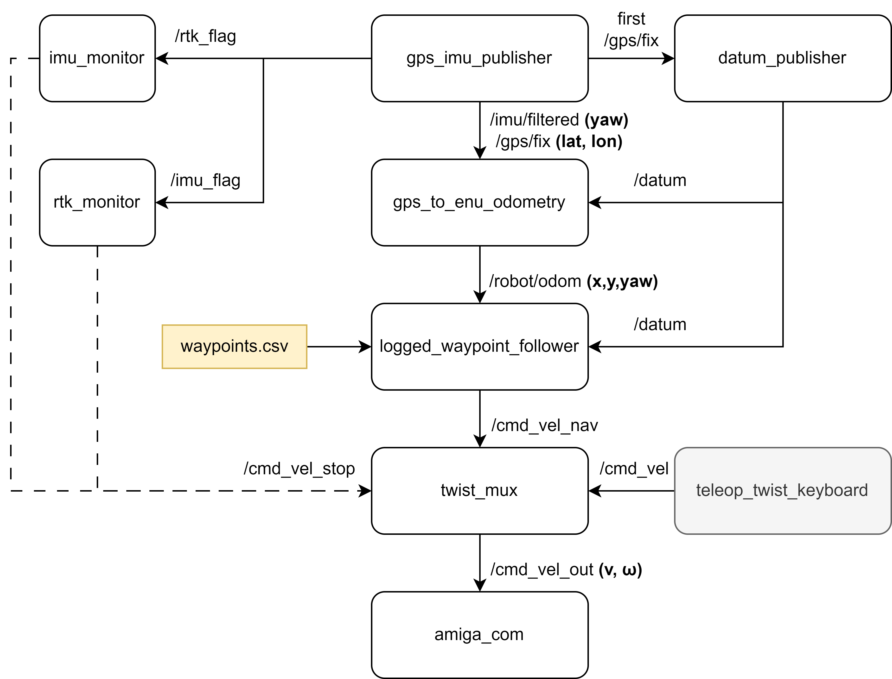

# Amiga_Navigation

Last updated by [Yiyuan Lin](yl3663@cornell.edu) on July 7, 2025

---


This is the ROS 2 package for GPS waypoint based navigation on Farm-ng Amiga robot with Emlid Reach RS3 GNSS receiver. The codebase is deployed on Raspberry Pi 5 with ROS2 Jazzy. 


## Overview




## Hardware

1. Farm-ng Amiga robot
2. Emlid Reach RS3 GNSS receiver
3. Raspberry Pi 5
4. Adafruit Feather M4 CAN micro controller


## Dependencies

1. Install Ubuntu 24.04 on Raspberry Pi 5

2. Install ROS2 Jazzy on Raspberry Pi 5 (Ubuntu) following the official [instruction](https://docs.ros.org/en/jazzy/Installation/Ubuntu-Install-Debs.html).

3. Install necessary Python packages by running

   ```bash
   pip install pyserial numpy simple-pid pynmea2 pyproj
   ```

   If you're on a Debian/Ubuntu system with a managed Python environment, , you may need to add the `--break-system-packages` flag:

   ```bash
   pip install --break-system-packages pyserial numpy simple-pid pynmea2 pyproj
   ```

   Or, to avoid conflicts, you can use a virtual environment.


## Getting Start

1. Edit the devices, port, parameters to your own setup.


2. log the waypoint for navigation

   ```bash
   ros2 launch amiga_navigation basic_bringup.launch.py
   ```
   
   Open another terminal and execute
   
   ```bash
   ros2 run amiga_navigation gps_waypoint_logger_keyboard
   ```
   
   

3. Execute the waypoints based navigation by running

   ```bash
   ros2 launch amiga_navigation basic_bringup.launch.py
   ```

   Open another terminal and execute
   
   ```bash
   cd amiga_navigation
   python3 src/amiga_navigation/amiga_navigation/logged_waypoint_follower.py --waypoints /home/cairlab/navigation_waypoints/latest_waypoints.csv
   ```


## PID Controller for Line Tracking

We use a **PID controller** to minimize the **cross-track error**, which is the signed distance between the robot and the planned path segment. The controller adjusts the robot's lateral velocity (`v_y_l`) perpendicular to the path, enabling smooth and accurate line tracking.

The PID controller computes correction as:


$$
v_{y_l} = K_p \cdot e(t) + K_i \cdot \int e(t)\,dt + K_d \cdot \frac{d}{dt} e(t)
$$


Where:

- $e(t)$ is the cross-track error at time ttt
- $K_P$ (proportional gain): corrects based on the current error
- $K_i$ (integral gain): corrects accumulated past errors
- $K_d$ (derivative gain): predicts future error based on rate of change

The computed lateral velocity is rotated to the world frame and combined with a forward velocity (`v_x_l`) to generate robot motion commands (`v`, `w`) using a differential drive model.

### PID Parameter Tuning Guide

| Parameter           | Effect                      | Increase to...                                              | Decrease to...                                   |
| ------------------- | --------------------------- | ----------------------------------------------------------- | ------------------------------------------------ |
| `Kp` (Proportional) | Reacts to current error     | Respond faster, reduce large deviations                     | Reduce overshooting or oscillation               |
| `Ki` (Integral)     | Accumulates long-term error | Eliminate steady-state drift (e.g., always off to one side) | Prevent slow oscillation or integral wind-up     |
| `Kd` (Derivative)   | Predicts future error       | Dampen oscillations and improve stability                   | Increase responsiveness if system feels sluggish |

### Quick Behavior-based Tuning Reference

| Robot Behavior                            | Suggested Adjustment                        |
| ----------------------------------------- | ------------------------------------------- |
| Drifts slowly back to path                | **Increase `Kp`**                           |
| Quickly overshoots and wobbles left-right | **Decrease `Kp`, Increase `Kd`**            |
| Always off to one side                    | **Increase `Ki`**                           |
| Too sluggish in correction                | **Increase `Kp`, optionally decrease `Kd`** |
| Mild, slow oscillation                    | **Decrease `Ki`, Increase `Kd`**            |


## Maintenance

For any questions or uncertainty, please contact Yiyuan Lin ([yl3663@cornell.edu](mailto:yl3663@cornell.edu)).
