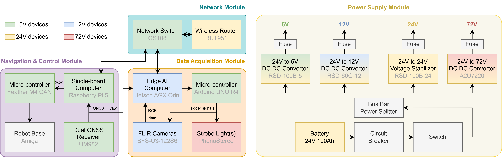

# PPBv2

Last updated by [Yiyuan Lin](mailto:yl3663@cornell.edu) on August 25, 2026

---

This repository includes the codebase for our phenotyping robot PhytoPatholoBot version 2 (PPBv2). PPBv2 is a mobile robotic platform designed for high-throughput phenotyping in field environments and optimized for tasks such as disease phenotyping, supporting precise spatiotemporal mapping of phenotypic traits. Equipped with an active illumination system and stereo imaging, PPBv2 enables robust and consistent visual data acquisition under natural lighting variability. The robot is powered by a Raspberry Pi 5 for navigation control and integrates with external triggers and logging systems for synchronized image capture and georeferencing.


## Repository Branches

This repository provides two coordinated GPS configurations. Each branch applies to the complete PPBv2 system, including both `PPBv2_Navigation` and `PPBv2_Imaging`:

- **`main` (recommended):** The current implementation based on a dual-antenna UM982 GNSS receiver. Navigation uses RTK position and true heading without a separate IMU, while Imaging records ANT1 position, the dual-antenna midpoint, and heading information.
- **`single-gps-imu`:** The legacy implementation based on a single GPS receiver and an IMU. It also contains the corresponding earlier Imaging implementation for single-GPS position logging.

Switch between the two complete system configurations with:

```bash
git switch main            # Dual GPS
git switch single-gps-imu  # Single GPS + IMU
```

<br>

## PPBv2 Modular Design



<br>

## PPBv2 Navigation

The navigation stack is deployed on a Raspberry Pi 5 running Ubuntu 24.04 and ROS 2 Jazzy. For Dual GPS setup and implementation details, see the [PPBv2 Navigation README](PPBv2_Navigation/README.md).

<br>

## PPBv2 Imaging

This is the ROS 2 package for synchronized multi-camera image triggering, GPS data logging, and external strobe light control for high-throughput  phenotyping. The codebase is deployed on NVIDIA Jetson AGX Orin with ROS2 Humble.

For implementation details, please refer to: [PPBv2 Imaging README](PPBv2_Imaging/README.md).

<br>

## Citation

If you find this work useful for your research, please consider citing our work:

```bibtex
Citation information will be updated upon publication.
```

<br>

## Maintenance

For any questions or uncertainty, please contact Yiyuan Lin ([yl3663@cornell.edu](mailto:yl3663@cornell.edu)).
